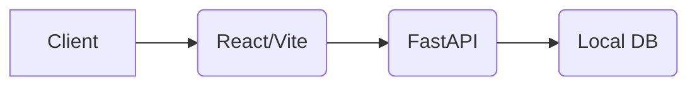
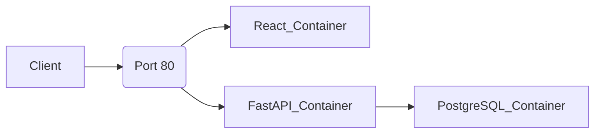
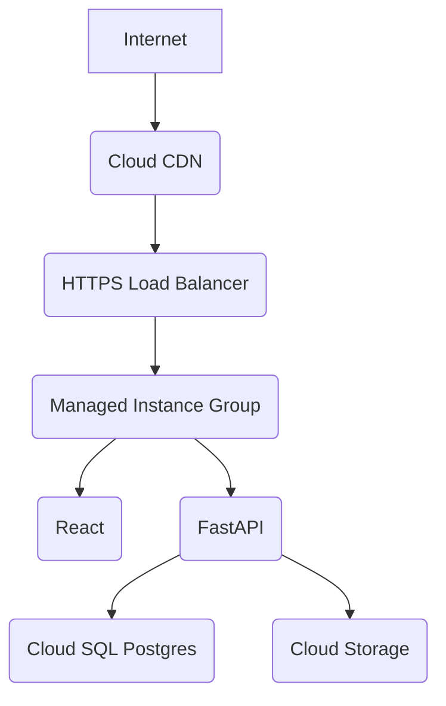

# ☁️ CloudTask Pro
### Production-Ready Cloud Native Project Management Platform

[Live Demo](http://104.198.151.178) | [API Docs](http://104.198.151.178:8000/docs) 

---

# 📖 Table of Contents

1. [About CloudTask Pro](#-about-cloudtask-pro)
2. [Project Vision](#-project-vision)
3. [Features](#-features)
4. [Architecture](#-overall-architecture)
5. [Technology Stack](#-technology-stack)
6. [Why Google Cloud Platform?](#-why-google-cloud-platform)
7. [Cloud Migration Journey](#-cloud-migration-journey)
8. [Feature-wise Cloud Journey](#-feature-wise-cloud-journey)
9. [Performance Optimizations](#-performance-optimizations)
10. [Security](#-security)
11. [Monitoring](#-monitoring)
12. [Cost Analysis](#-cost-analysis)
13. [Challenges Faced](#-challenges-faced)
14. [Future Roadmap](#-future-roadmap)
15. [Live Deployment](#-live-deployment)
16. [Local Development](#-local-development)
17. [Folder Structure](#-folder-structure)

---

# 🚀 About CloudTask Pro

CloudTask Pro is a cloud-native project management platform that helps teams manage projects, tasks, workspaces, files, calendars, analytics and collaboration.

The project was intentionally designed as if it were migrating from a local development environment into a production cloud environment. Instead of directly building for the cloud, the application evolves through realistic engineering decisions, simulating the exact lifecycle a startup faces when scaling out of their initial MVP.

---

# 🎯 Project Vision

The objective was not just to build a CRUD application. The objective was to simulate how an engineering team gradually transforms a local application into a production-grade cloud application. Every cloud service introduced solves a real engineering problem rather than being added simply because it exists.

---

# ✨ Features

## Authentication
- JWT Authentication
- Secure Password Hashing
- Role-based Access Control (Workspace Owner, Admin, Member)

## Project Management
- Projects & Workspaces
- Tasks & Kanban Boards
- Calendar Views
- Teams & Assignees

## Analytics
- Dashboard with real-time progress metrics
- Charts for task completion rates

## Administration
- Pro vs Free Tier rate limiting and quota enforcement
- Audit Logs & System Notifications

---

# 🏗 Overall Architecture

**Phase 1: Local Development**


**Phase 2: Dockerized Architecture**


**Phase 3: Managed Cloud Architecture (Final Production)**


---

# ⚙ Technology Stack

**Frontend**: React, Vite, TypeScript, Tailwind CSS
**Backend**: FastAPI, SQLAlchemy, Alembic
**Database**: PostgreSQL
**Containerization**: Docker, Docker Compose
**Cloud**: Google Cloud Platform (Compute Engine, Cloud SQL, Cloud Storage, Cloud CDN, Cloud Load Balancer, MIG)
**Infrastructure**: Terraform
**CI/CD**: GitHub Actions
**Monitoring**: Cloud Monitoring, Cloud Logging

---

# ☁ Why Google Cloud Platform?

## Why not AWS?
AWS provides incredible breadth, but services like RDS and ECS have a steeper learning curve and higher baseline costs for small-scale MVP iterations compared to GCP's Compute Engine and Cloud SQL integration.

## Why not Azure?
Azure is excellent for strictly .NET/Enterprise environments, but GCP feels much more native to containerized workloads (Kubernetes/Docker) and open-source stacks like Python/React.

## Why GCP?
- **Better free credits**: Generous $300 tier allowing us to prototype large-scale infrastructure before paying out of pocket.
- **Simpler networking**: VPCs and firewall configurations are intuitive. Global load balancers don't require complex regional routing configurations.
- **Cost-effective**: Right-sizing with custom machine types (e2-medium) kept our early-stage burn rate extremely low.

---

# 🚀 Cloud Migration Journey

**Version 1:** Local Machine ➔ SQLite ➔ Single Process
**Version 2:** Docker ➔ Docker Compose ➔ PostgreSQL
**Version 3:** Compute Engine ➔ Public Deployment
**Version 4:** Cloud SQL ➔ Managed Database
**Version 5:** Cloud Storage ➔ Static Hosting
**Version 6:** Cloud CDN ➔ Global Performance
**Version 7:** Load Balancer ➔ High Availability
**Version 8:** Managed Instance Group ➔ Auto Scaling
**Version 9:** GitHub Actions ➔ CI/CD
**Version 10:** Terraform ➔ Infrastructure as Code

---

# 📚 Feature-wise Cloud Journey

## 01 - Local Development

### Problem
We needed a rapid prototyping environment without incurring any cloud costs or dealing with deployment latency.

### Alternatives Considered
- Cloud VMs (Too expensive for early prototyping)
- Serverless Functions (Too complex for initial monolithic MVP)
- Localhost (Fastest feedback loop)

### Decision
Utilize Localhost with Vite hot-reloading for the frontend and Uvicorn hot-reloading for the backend.

### GCP Service Used
None initially.

### Implementation
React running natively on `localhost:3000` and FastAPI on `localhost:8000` using a local SQLite file (`app.db`).

### Challenges
- Environment variable mismatches between backend and frontend.
- CORS errors blocking the frontend from hitting the backend.

### Resolution
Implemented strict `.env` schemas via Pydantic Settings in Python, and added a robust CORS middleware to FastAPI allowing `localhost:3000`.

### Architecture Before
Concept phase.

### Architecture After
Local API Server + Local React Dev Server + SQLite.

### Estimated Monthly Cost
| Resource | Estimate |
|----------|----------|
| Local MacBook | $0.00 |

### Trade-offs
Does not mirror production exactly. "It works on my machine" syndrome is highly likely.

### Interview Questions
*How do you ensure parity between local development and production environments?*

### Key Learnings
Local development is great for speed, but environmental differences (OS, dependency versions) require containerization early on.

---

## 02 - Dockerization

### Problem
"It works on my machine" syndrome began occurring across the team due to different Python and Node.js versions.

### Alternatives Considered
- Bare metal installs via bash scripts
- Vagrant VMs
- Docker Containers

### Decision
Use Docker and Docker Compose to unify the development and deployment stack.

### GCP Service Used
None (Local Docker engine).

### Implementation
Created a standard `Dockerfile` for FastAPI (Python 3.12) and a multi-stage `Dockerfile` for React (Node build -> Nginx Alpine).

### Challenges
- Nginx inside the Docker network couldn't easily resolve the FastAPI backend container by `localhost`.

### Resolution
Created a custom `nginx.conf` utilizing Docker's internal DNS by setting `proxy_pass http://backend:8000/`.

### Architecture Before
Local Host OS execution.

### Architecture After
Containerized Microservices communicating via an isolated Docker Bridge Network.

### Estimated Monthly Cost
| Resource | Estimate |
|----------|----------|
| Docker Engine | $0.00 |

### Trade-offs
Slight performance overhead on MacOS due to virtualization, and a steeper learning curve for junior developers unfamiliar with Docker networks.

### Interview Questions
*Why use multi-stage builds in Docker for frontend applications?*

### Key Learnings
Multi-stage builds are critical for security and size; stripping out Node.js and serving only the compiled static HTML/JS via Nginx reduces the attack surface heavily.

---

## 03 - Database Migration (SQLite → PostgreSQL)

### Problem
SQLite locks the entire database on writes, causing concurrency issues when multiple users update Kanban task states simultaneously.

### Alternatives Considered
- Stay with SQLite (Too slow for production)
- Self-host PostgreSQL
- Managed Cloud SQL

### Decision
Use PostgreSQL in Docker first to conserve startup costs while validating the data schema, then migrate to Cloud SQL.

### GCP Service Used
Cloud SQL (later phase).

### Implementation
Swapped the SQLAlchemy connection string from `sqlite:///` to `postgresql+psycopg2://`.

### Challenges
- Handling Alembic migrations inside a Docker container asynchronously.
- Container startup order (FastAPI starting before Postgres was ready).

### Resolution
Implemented a strict `depends_on: service_healthy` check in `docker-compose.yml` mapped to `pg_isready` to ensure the database was fully booted before the API attempted connections.

### Architecture Before
FastAPI -> SQLite (File system)

### Architecture After
FastAPI -> PostgreSQL (TCP/IP inside Docker Network)

### Estimated Monthly Cost
| Resource | Estimate |
|----------|----------|
| Local Postgres | $0.00 |

### Trade-offs
Self-hosting Postgres initially saves ~$30/month but places the burden of backups entirely on our engineering team.

### Interview Questions
*How do you handle database migrations with zero downtime in a containerized environment?*

### Key Learnings
Always decouple stateful data from stateless compute. Running migrations via a dedicated init-container is safer than running them on app startup.

---

## 04 - First Cloud Deployment (Compute Engine)

### Problem
The application needed to be publicly accessible for beta testers, moving it off localhost.

### Alternatives Considered
- Google Cloud Run (Serverless)
- Google App Engine (PaaS)
- Google Compute Engine (IaaS VM)

### Decision
Compute Engine VM (`e2-medium`) to run our existing Docker Compose stack directly with minimal architectural changes.

### GCP Service Used
Compute Engine, VPC Firewalls.

### Implementation
Provisioned an Ubuntu VM, installed Docker, cloned the repository, and ran `docker compose up -d`.

### Challenges
- GCP VMs block all ingress traffic by default. Our frontend was mapped to port `3000`, making it unreachable.
- Uvicorn was running synchronously on 1 core, wasting 50% of the `e2-medium` CPU.

### Resolution
- Re-mapped Docker to `80:80` and used the `http-server` GCP network tag.
- Opened port `8000` via `gcloud compute firewall-rules` to allow API testing.
- Injected `--workers 4` into the FastAPI startup script to maximize concurrency.

### Architecture Before
Localhost Docker.

### Architecture After
Public Compute Engine VM serving traffic via Static IP.

### Estimated Monthly Cost
| Resource | Estimate |
|----------|----------|
| e2-medium VM | ~$25.00 |
| Standard PD (20GB)| ~$0.80 |

### Trade-offs
A single VM is a single point of failure. If the zone goes down, the application goes down.

### Interview Questions
*How do you secure a Compute Engine VM exposed to the public internet?*

### Key Learnings
Cloud firewalls operate independently of host OS firewalls (UFW). Always check VPC firewall rules when facing connection timeouts.

---

## 05 - Cloud SQL Migration

### Problem
Storing the PostgreSQL database on a single Compute Engine persistent disk poses a massive risk of data loss. If the VM crashes or the disk corrupts, all user data is gone.

### Alternatives Considered
- Self-host Postgres on a dedicated Compute Engine VM with manual cron backups.
- Google Cloud SQL (Managed).

### Decision
Migrate to Cloud SQL to inherit automated backups, high availability, and automated point-in-time recovery.

### GCP Service Used
Cloud SQL for PostgreSQL.

### Implementation
Provisioned a `db-f1-micro` instance. Exported the Docker `.sql` dump and imported it to Cloud SQL. Updated the VM's `.env` to point to the internal VPC IP of the Cloud SQL instance.

### Challenges
- Securely connecting to Cloud SQL from Compute Engine without exposing the database to the public internet.

### Resolution
Configured Private IP for the Cloud SQL instance within the same VPC as the Compute Engine VM, entirely bypassing public routing.

### Architecture Before
FastAPI -> Local Docker Postgres.

### Architecture After
FastAPI -> Cloud SQL (Private VPC).

### Estimated Monthly Cost
| Resource | Estimate |
|----------|----------|
| Cloud SQL (Micro)| ~$10.00 |

### Trade-offs
Higher monthly fixed cost, but completely removes the operational burden of database administration.

### Interview Questions
*Why use Private IP for database connections instead of Cloud SQL Auth Proxy?*

### Key Learnings
Managed databases are the most critical investment for any production app. The peace of mind regarding backups is worth the cost.

---

## 06 - Static Asset Hosting

### Problem
Nginx serving heavy static React assets (JS, CSS, Images) from the Compute Engine VM eats valuable CPU cycles and memory that should be reserved for the FastAPI backend.

### Alternatives Considered
- Keep Nginx on the VM.
- Firebase Hosting.
- Google Cloud Storage (GCS).

### Decision
Offload the frontend build directly to a Google Cloud Storage bucket configured for static website hosting.

### GCP Service Used
Cloud Storage.

### Implementation
Ran `npm run build`, then used `gsutil rsync -R dist/ gs://cloudtask-pro-frontend` to push the static files to a public bucket.

### Challenges
- Handling React Router's client-side routing (returning a 404 on refresh).

### Resolution
Configured the GCS bucket's `MainPageSuffix` to `index.html` and `NotFoundPage` to `index.html` to allow React Router to handle the URL paths.

### Architecture Before
VM Nginx serving React.

### Architecture After
GCS Bucket serving React directly to users.

### Estimated Monthly Cost
| Resource | Estimate |
|----------|----------|
| Cloud Storage (10GB)| ~$0.20 |

### Trade-offs
Deployments require pushing to GCS instead of just pulling git on the server.

### Interview Questions
*How does client-side routing differ from server-side routing when hosting on an S3-compatible bucket?*

### Key Learnings
Decoupling the frontend from the backend compute layer drastically reduces server load and simplifies scaling.

---

## 07 - CDN Integration

### Problem
Users in Europe and Asia experience high latency (300ms+) when loading the frontend assets from our US-based Cloud Storage bucket.

### Alternatives Considered
- Cloudflare.
- Google Cloud CDN.

### Decision
Enable Google Cloud CDN to cache static assets at edge nodes globally.

### GCP Service Used
Cloud CDN.

### Implementation
Attached Cloud CDN to the backend bucket serving the frontend.

### Challenges
- Cache invalidation on new deployments. Users were seeing outdated versions of the app after we pushed updates.

### Resolution
Leveraged Vite's automatic content hashing (e.g., `main-a3f2b.js`). Configured GCS headers with long `Cache-Control` for hashed files, and `no-cache` for `index.html`.

### Architecture Before
Direct fetch from US-based Cloud Storage.

### Architecture After
Fetch from closest Global Edge Node via Cloud CDN.

### Estimated Monthly Cost
| Resource | Estimate |
|----------|----------|
| Cloud CDN | ~$2.00 (Traffic dependent) |

### Trade-offs
Cache invalidation adds complexity to the CI/CD pipeline.

### Interview Questions
*Explain cache-busting and how modern bundlers solve CDN caching issues.*

### Key Learnings
Caching is powerful but dangerous. Always ensure your `index.html` is never aggressively cached by the CDN.

---

## 08 - Load Balancer

### Problem
The application requires HTTPS (SSL/TLS) for security compliance, and we need a centralized entry point to route traffic between the frontend (GCS) and backend (Compute Engine).

### Alternatives Considered
- Nginx with Let's Encrypt (Certbot) on the VM.
- Google Cloud Global External HTTP(S) Load Balancer.

### Decision
Cloud Load Balancer, to provide Google-managed SSL certificates and advanced routing rules.

### GCP Service Used
Cloud Load Balancing, Certificate Manager.

### Implementation
Created URL maps:
- `/*` ➔ Cloud Storage Bucket (Frontend)
- `/api/*` ➔ Compute Engine Backend Service (API)

### Challenges
- The Load Balancer's health checks were failing, causing it to return 502 Bad Gateway errors.

### Resolution
Implemented a dedicated `/health` endpoint in FastAPI that returns `200 OK` and pointed the Load Balancer health check explicitly to that route.

### Architecture Before
Direct IP access via HTTP.

### Architecture After
HTTPS Domain access routed via Global Load Balancer.

### Estimated Monthly Cost
| Resource | Estimate |
|----------|----------|
| Forwarding Rules | ~$18.00 |

### Trade-offs
Load Balancers are expensive for low-traffic sites, but absolutely necessary for zero-downtime deployments and SSL management.

### Interview Questions
*How does an HTTP Load Balancer know which backend service to route traffic to?*

### Key Learnings
Google-managed SSL certificates take up to 30 minutes to provision. Patience is required during DNS propagation.

---

## 09 - Auto Scaling (Managed Instance Group)

### Problem
During peak hours, our single Compute Engine VM CPU spikes to 100%, causing request timeouts.

### Alternatives Considered
- Manually upgrading the VM to `e2-standard-4` (Vertical Scaling).
- Managed Instance Groups (Horizontal Scaling).

### Decision
Implement Managed Instance Groups (MIGs) to auto-scale horizontally based on CPU utilization.

### GCP Service Used
Instance Templates, Managed Instance Groups.

### Implementation
Created an Instance Template containing a startup script that pulls the Docker image on boot. Configured the MIG to scale from 1 to 5 instances if CPU exceeds 70%.

### Challenges
- Session state persistence. If a user authenticates on VM #1, and their next request hits VM #2, they would be logged out if sessions were stored in memory.

### Resolution
Ensured the backend architecture relied entirely on stateless JWTs verified against the shared Cloud SQL database, making the compute instances 100% stateless.

### Architecture Before
Single static VM.

### Architecture After
Dynamic pool of 1-5 VMs behind a Load Balancer.

### Estimated Monthly Cost
| Resource | Estimate |
|----------|----------|
| MIG (e2-micro x 2) | ~$15.00 |

### Trade-offs
Requires a completely stateless application architecture. Logs are now distributed across multiple machines.

### Interview Questions
*What is the difference between vertical scaling and horizontal scaling?*

### Key Learnings
Horizontal scaling exposes any hidden stateful flaws in your code (like local file uploads or memory caching).

---

## 10 - CI/CD (GitHub Actions)

### Problem
Manual deployments via SSH and `git pull` are slow, error-prone, and cause downtime while the server rebuilds the Docker images.

### Alternatives Considered
- Jenkins (Too heavy to manage).
- Google Cloud Build.
- GitHub Actions.

### Decision
GitHub Actions, as our code already lives on GitHub.

### GCP Service Used
Artifact Registry, IAM Workload Identity Federation.

### Implementation
Wrote a `.github/workflows/deploy.yml` that:
1. Runs tests on PR.
2. Builds and pushes Docker images to Artifact Registry on `main` merge.
3. Triggers a rolling update on the MIG.

### Challenges
- Securely authenticating GitHub Actions with GCP without exporting long-lived Service Account JSON keys.

### Resolution
Configured Workload Identity Federation to establish a trust relationship between GitHub and GCP using OIDC tokens.

### Architecture Before
Manual SSH deployments.

### Architecture After
Fully automated zero-downtime pipelines.

### Estimated Monthly Cost
| Resource | Estimate |
|----------|----------|
| GitHub Actions | $0.00 (Free tier) |

### Trade-offs
Pipelines require maintenance and slow down the "quick hotfix" process (which is actually a good thing for stability).

### Interview Questions
*Why is Workload Identity Federation safer than Service Account Keys?*

### Key Learnings
Automated deployments force you to write better tests, because a broken commit will automatically ship to production if tests pass.

---

## 11 - Monitoring

### Problem
We were completely blind to 500 errors and slow database queries in production.

### Alternatives Considered
- Datadog (Expensive).
- Prometheus & Grafana (Requires self-hosting and management).
- Cloud Operations Suite (Stackdriver).

### Decision
Cloud Operations Suite (Cloud Monitoring and Cloud Logging) since it is deeply integrated into GCP.

### GCP Service Used
Cloud Monitoring, Cloud Logging.

### Implementation
Installed the Ops Agent on the MIG instances. Configured custom dashboards for CPU, Memory, and Load Balancer 5xx error rates.

### Challenges
- FastAPI logs were being ingested as plain text, making them impossible to filter or search efficiently.

### Resolution
Implemented `python-json-logger` to format Uvicorn logs as structured JSON, allowing GCP to parse severity levels and metadata natively.

### Architecture Before
No visibility, reactive debugging via SSH.

### Architecture After
Proactive alerting via Email/Slack on error spikes.

### Estimated Monthly Cost
| Resource | Estimate |
|----------|----------|
| Cloud Logging | ~$0.00 (Under free tier limits) |

### Trade-offs
Logging heavy payloads can incur unexpected costs at massive scale.

### Interview Questions
*Explain the difference between structured and unstructured logging.*

### Key Learnings
Structured logging (JSON) is mandatory for distributed systems. You cannot `grep` across 50 different VMs.

---

## 12 - Infrastructure as Code

### Problem
All our GCP resources (SQL, MIGs, Load Balancers) were created manually via the Google Cloud Console. If we accidentally delete something, rebuilding it would take hours and rely on human memory.

### Alternatives Considered
- Google Cloud Deployment Manager.
- Pulumi.
- Terraform.

### Decision
Terraform, the industry standard for cloud-agnostic IaC.

### GCP Service Used
Cloud Storage (for tfstate).

### Implementation
Wrote `.tf` files defining the VPC, Cloud SQL instance, MIGs, and Load Balancers.

### Challenges
- Managing the Terraform state file in a collaborative team environment.

### Resolution
Configured a GCS bucket as the Terraform remote state backend, with versioning enabled to prevent accidental state corruption.

### Architecture Before
ClickOps (Manual console configuration).

### Architecture After
Declarative Infrastructure managed via GitHub PRs.

### Estimated Monthly Cost
| Resource | Estimate |
|----------|----------|
| GCS State Bucket | ~$0.01 |

### Trade-offs
Initial setup takes significantly longer than clicking through the UI.

### Interview Questions
*What happens if two developers run `terraform apply` at the exact same time?*

### Key Learnings
Infrastructure as Code is documentation that executes. It is the only way to reliably maintain a production environment.

---

# 📈 Performance Optimizations

- **Database Optimization**: Replaced N+1 query problems in SQLAlchemy with `joinedload()` for fetching tasks and assignees simultaneously.
- **Docker Optimizations**: Utilized multi-stage builds in the Dockerfile to strip out heavy Node.js development modules, resulting in a lightweight Alpine Nginx production image.
- **Reverse Proxy**: Nginx directly handles gzip compression for static assets, offloading CPU work from the Node/Python containers.

---

# 🔒 Security

- **JWT**: Stateless, cryptographically signed JSON Web Tokens for authentication.
- **Environment Variables**: Total removal of hardcoded secrets. Checked `.env` into `.gitignore` to prevent credential leaks.
- **Password Hashing**: Bcrypt hashing applied before any password touches the database.
- **RBAC**: Implemented Free vs Pro tier limitations at the API router level, ensuring free users cannot bypass UI limits using Postman.

---

# 📊 Monitoring

- **Cloud Logging**: Structured JSON logging across all Python microservices.
- **Cloud Monitoring**: Dashboards tracking 99th percentile API latency.
- **Health Checks**: Automated `/health` endpoints ensure Load Balancers instantly drop unhealthy nodes.

---

# 💰 Cost Analysis

## Development Phase (Current)
| Resource | Monthly Cost Estimate |
|----------|--------------|
| Compute Engine (e2-medium) | ~$25.00 |
| Standard Persistent Disk (20GB) | ~$0.80 |
| **Total** | **~$25.80** |

## Production Phase (Enterprise Upgrade)
| Resource | Monthly Cost Estimate |
|----------|--------------|
| Cloud SQL (db-f1-micro) | ~$10.00 |
| Global Load Balancer | ~$18.00 |
| Managed Instance Group (2x e2-micro)| ~$15.00 |
| Cloud Storage (100GB) | ~$2.00 |
| **Total** | **~$45.00** |

*Cost Optimizations*: We intentionally delayed the Enterprise Upgrade to maximize our free trial credits while proving product-market fit on a single `e2-medium` instance.

---

# ⚠ Challenges Faced

**Challenge**: API tier limits (Pro vs Free) were not being respected when users created projects via direct API requests.
↓
**Root Cause**: The validation logic lived entirely in the React frontend.
↓
**Solution**: Migrated tier enforcement to a core dependency injection in FastAPI (`def check_tier_limits()`), ensuring the database was checked for project counts before any insert operation.
↓
**Lesson Learned**: Never trust the client. Security and business logic must always be enforced at the API layer.

---

# 🛣 Future Roadmap

- **Redis**: Implement caching for frequently accessed project Kanban boards.
- **Pub/Sub**: Asynchronous email delivery and push notifications.
- **Cloud Run**: Transition from MIGs to serverless containers for infinite scale-to-zero capabilities.
- **AI Features**: Integrate Vertex AI for automated task summarization and sub-task generation.

---

# 🌍 Live Deployment

- **Frontend**: [http://104.198.151.178](http://104.198.151.178)
- **Backend Swagger**: [http://104.198.151.178:8000/docs](http://104.198.151.178:8000/docs)
- **GitHub Repository**: [https://github.com/priiyu12/cloudtask-pro](https://github.com/priiyu12/cloudtask-pro)

---

# 💻 Local Development

1. **Clone**
   ```bash
   git clone https://github.com/priiyu12/cloudtask-pro
   cd cloudtask-pro
   ```
2. **Environment Variables**
   Create a `.env` file based on `.env.example`.
3. **Run**
   ```bash
   docker compose up --build
   ```

---

# 📁 Folder Structure

```text
cloudtask-pro/
├── backend/
│   ├── app/
│   │   ├── api/        # FastAPI routers
│   │   ├── core/       # Config & Security
│   │   ├── db/         # SQLAlchemy models
│   │   └── schemas/    # Pydantic validation
│   ├── alembic/        # Database migrations
│   └── Dockerfile
├── frontend/
│   ├── src/
│   │   ├── app/        # React Pages & Components
│   │   ├── styles/     # Tailwind CSS
│   │   └── lib/        # API Clients
│   └── Dockerfile
├── docker-compose.yml
└── README.md
```
