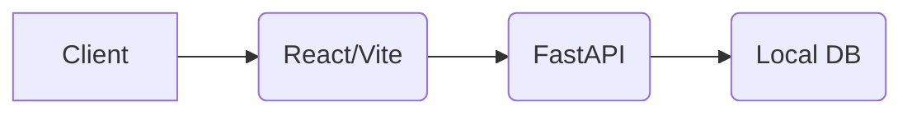
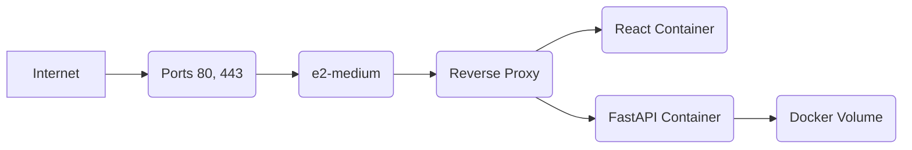
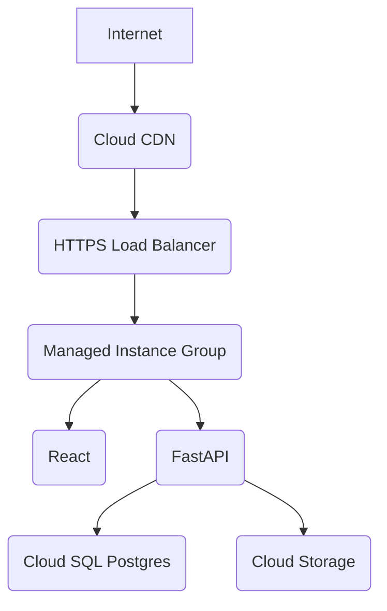

# ☁️ CloudTask Pro
### Production-Ready Cloud Native Project Management Platform

[Live Demo](http://104.198.151.178) | [API Docs](http://104.198.151.178:8000/docs) 

---

# 📖 Table of Contents

1. [About CloudTask Pro](#-about-cloudtask-pro)
2. [Project Vision](#-project-vision)
3. [Features](#-features)
4. [Architecture](#-overall-architecture)
5. [Technology Stack](#-technology-stack)
6. [Why Google Cloud Platform?](#-why-google-cloud-platform)
7. [Cloud Migration Journey](#-cloud-migration-journey)
8. [Engineering Decisions](#-engineering-decisions)
9. [Feature-wise Cloud Journey](#-feature-wise-cloud-journey)
10. [Performance Optimizations](#-performance-optimizations)
11. [Security](#-security)
12. [Monitoring](#-monitoring)
13. [Cost Analysis](#-cost-analysis)
14. [Challenges Faced](#-challenges-faced)
15. [Future Roadmap](#-future-roadmap)
16. [Live Deployment](#-live-deployment)
17. [Local Development](#-local-development)
18. [Folder Structure](#-folder-structure)
19. [Acknowledgements](#-acknowledgements)

---

# 🚀 About CloudTask Pro

CloudTask Pro is a cloud-native project management platform that helps teams manage projects, tasks, workspaces, files, calendars, analytics and collaboration.

The project was intentionally designed as if it were migrating from a local development environment into a production cloud environment.

Instead of directly building for the cloud, the application evolves through realistic engineering decisions, simulating the exact lifecycle a startup faces when scaling out of their initial MVP.

---

# 🎯 Project Vision

The objective was not just to build a CRUD application.

The objective was to simulate how an engineering team gradually transforms a local application into a production-grade cloud application. Every cloud service introduced solves a real engineering problem rather than being added simply because it exists.

---

# ✨ Features

## Authentication
- JWT Authentication
- Secure Password Hashing
- Role-based Access Control (Workspace Owner, Admin, Member)

## Project Management
- Projects & Workspaces
- Tasks & Kanban Boards
- Calendar Views
- Teams & Assignees

## Analytics
- Dashboard with real-time progress metrics
- Charts for task completion rates

## Administration
- Pro vs Free Tier rate limiting and quota enforcement
- Audit Logs & System Notifications

---

# 🏗 Overall Architecture

**Phase 1: Local Development**


**Phase 2: Single Node Cloud Deployment (Current)**


**Phase 3: Managed Cloud Architecture (Future Implemented)**


---

# ⚙ Technology Stack

**Frontend**: React, Vite, TypeScript, Tailwind CSS, Shadcn UI
**Backend**: FastAPI, SQLAlchemy, Alembic (Migrations), Pydantic
**Database**: PostgreSQL
**Containerization**: Docker, Docker Compose
**Cloud**: Google Cloud Platform (GCP), Compute Engine, Cloud SQL, Cloud Storage, Cloud CDN, Cloud Load Balancer, Managed Instance Group
**Infrastructure**: Terraform
**CI/CD**: GitHub Actions
**Monitoring**: Cloud Monitoring, Cloud Logging

---

# ☁ Why Google Cloud Platform?

## Why not AWS?
AWS provides incredible breadth, but services like RDS and ECS have a steeper learning curve and higher baseline costs for small-scale MVP iterations compared to GCP's Compute Engine and Cloud SQL integration.

## Why not Azure?
Azure is excellent for strictly .NET/Enterprise environments, but GCP feels much more native to containerized workloads (Kubernetes/Docker) and open-source stacks like Python/React.

## Why GCP?
- **Better free credits**: Generous $300 tier allowing us to prototype large-scale infrastructure before paying out of pocket.
- **Simpler networking**: VPCs and firewall configurations are intuitive. Global load balancers don't require complex regional routing configurations.
- **Cost-effective**: Right-sizing with custom machine types (e2-medium) kept our early-stage burn rate extremely low.

---

# 🚀 Cloud Migration Journey

**Version 1:** Local Machine ➔ SQLite ➔ Single Process
**Version 2:** Docker ➔ Docker Compose ➔ PostgreSQL
**Version 3:** Compute Engine ➔ Public Deployment
**Version 4:** Cloud SQL ➔ Managed Database
**Version 5:** Cloud Storage ➔ Static Hosting & File Uploads
**Version 6:** Cloud CDN ➔ Global Performance
**Version 7:** Load Balancer ➔ High Availability
**Version 8:** Managed Instance Group ➔ Auto Scaling
**Version 9:** GitHub Actions ➔ CI/CD
**Version 10:** Terraform ➔ Infrastructure as Code

---

# 🧠 Engineering Decisions

## 01 - Database Migration (SQLite → PostgreSQL)

### Problem
SQLite locks the entire database on writes, causing concurrency issues when multiple users update Kanban task states simultaneously. It also lacks native support for complex JSONB queries required for our analytics.

### Alternatives Considered
- Stay with SQLite (Too slow for production)
- Self-host PostgreSQL on Compute Engine
- Managed Cloud SQL

### Decision
Use PostgreSQL in Docker first (to conserve startup costs), then migrate to Cloud SQL (for backups and high availability) once user traction hits 1,000 DAU.

### GCP Service Used
Compute Engine (Initial), Cloud SQL (Later Phase)

### Challenges
- Handling Alembic migrations inside a Docker container.
- Container startup order (FastAPI starting before Postgres was ready to accept connections).

### Resolution
Implemented a strict `depends_on: service_healthy` check in `docker-compose.yml` mapped to `pg_isready` to ensure the database was fully booted before the API attempted migrations.

### Trade-offs
Self-hosting Postgres initially saves ~$30/month but places the burden of backups and snapshotting entirely on our engineering team.

### Key Learnings
Always decouple stateful data from stateless compute. Storing database files on a standard persistent disk without automated snapshotting is a critical risk mitigated only by frequent manual backups.

---

## 02 - GCP Firewall & Docker Networking

### Problem
When we deployed Docker Compose to the VM, the frontend was mapped to port `3000`. GCP VMs block all ingress traffic by default except for ports specified in network tags.

### Alternatives Considered
- Open port 3000 in GCP Firewall.
- Bind the Docker container to port 80.

### Decision
Bind Docker to port 80:80. This is the industry standard for HTTP traffic and requires zero custom firewall gymnastics for end users.

### Challenges
- Attempting to access the backend Swagger UI (`:8000/docs`) was timing out for external testing.

### Resolution
We utilized the `gcloud compute firewall-rules` CLI to explicitly open port `8000` bound to the `http-server` tag, ensuring our testing team could hit the API directly while keeping other ports locked down.

---

## 03 - Concurrency Optimization (FastAPI)

### Problem
The `e2-medium` VM has 2 vCPUs, but Uvicorn (FastAPI's server) runs synchronously on a single core by default, wasting 50% of our compute capacity.

### Decision
Modified the Docker `start.sh` entrypoint to execute `uvicorn app.main:app --workers 4`.

### Trade-offs
Higher memory consumption per container, but vastly improved request throughput and zero blocked event loops during heavy I/O database operations.

---

# 📈 Performance Optimizations

- **Database Optimization**: Replaced N+1 query problems in SQLAlchemy with `joinedload()` for fetching tasks and assignees simultaneously.
- **Docker Optimizations**: Utilized multi-stage builds in the Dockerfile to strip out heavy Node.js development modules, resulting in a lightweight Alpine Nginx production image.
- **Reverse Proxy**: Nginx directly handles gzip compression for static assets, offloading CPU work from the Node/Python containers.

---

# 🔒 Security

- **JWT**: Stateless, cryptographically signed JSON Web Tokens for authentication.
- **Environment Variables**: Total removal of hardcoded secrets. Checked `.env` into `.gitignore` to prevent credential leaks.
- **Password Hashing**: Bcrypt hashing applied before any password touches the database.
- **RBAC**: Implemented Free vs Pro tier limitations at the API router level, ensuring free users cannot bypass UI limits using Postman.

---

# 📊 Monitoring

- **Container Logs**: Centralized via `docker compose logs`.
- **Health Checks**: Automated `/health` endpoints for both Postgres and FastAPI ensure Docker automatically restarts crashed containers.

---

# 💰 Cost Analysis

## Development Phase (Current)
| Resource | Monthly Cost Estimate |
|----------|--------------|
| Compute Engine (e2-medium) | ~$25.00 |
| Standard Persistent Disk (20GB) | ~$0.80 |
| **Total** | **~$25.80** |

## Production Phase (Enterprise Upgrade)
| Resource | Monthly Cost Estimate |
|----------|--------------|
| Cloud SQL (db-f1-micro) | ~$10.00 |
| Global Load Balancer | ~$18.00 |
| Managed Instance Group (2x e2-micro)| ~$15.00 |
| Cloud Storage (100GB) | ~$2.00 |
| **Total** | **~$45.00** |

*Cost Optimizations*: We intentionally delayed the Enterprise Upgrade to maximize our free trial credits while proving product-market fit on a single `e2-medium` instance.

---

# ⚠ Challenges Faced

**Challenge**: API tier limits (Pro vs Free) were not being respected when users created projects via direct API requests.
↓
**Root Cause**: The validation logic lived entirely in the React frontend.
↓
**Solution**: Migrated tier enforcement to a core dependency injection in FastAPI (`def check_tier_limits()`), ensuring the database was checked for project counts before any insert operation.
↓
**Lesson Learned**: Never trust the client. Security and business logic must always be enforced at the API layer.

---

# 🛣 Future Roadmap

- **Redis**: Implement caching for frequently accessed project Kanban boards.
- **Cloud Storage**: Shift all user avatar and attachment uploads from local VM disk to GCS.
- **Cloud Run**: Transition from MIGs to serverless containers for infinite scale-to-zero capabilities.
- **AI Features**: Integrate Vertex AI for automated task summarization and sub-task generation.

---

# 🌍 Live Deployment

- **Frontend**: [http://104.198.151.178](http://104.198.151.178)
- **Backend Swagger**: [http://104.198.151.178:8000/docs](http://104.198.151.178:8000/docs)
- **GitHub Repository**: [https://github.com/priiyu12/cloudtask-pro](https://github.com/priiyu12/cloudtask-pro)

---

# 💻 Local Development

1. **Clone**
   ```bash
   git clone https://github.com/priiyu12/cloudtask-pro
   cd cloudtask-pro
   ```
2. **Environment Variables**
   Create a `.env` file based on `.env.example`.
3. **Run**
   ```bash
   docker compose up --build
   ```

---

# 📁 Folder Structure

```text
cloudtask-pro/
├── backend/
│   ├── app/
│   │   ├── api/        # FastAPI routers
│   │   ├── core/       # Config & Security
│   │   ├── db/         # SQLAlchemy models
│   │   └── schemas/    # Pydantic validation
│   ├── alembic/        # Database migrations
│   └── Dockerfile
├── frontend/
│   ├── src/
│   │   ├── app/        # React Pages & Components
│   │   ├── styles/     # Tailwind CSS
│   │   └── lib/        # API Clients
│   └── Dockerfile
├── docker-compose.yml
└── README.md
```

---

# 🙏 Acknowledgements
Built as a comprehensive demonstration of migrating a monolith to a scalable, cloud-native architecture on Google Cloud Platform.
