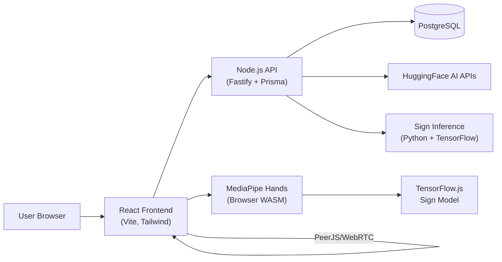

# 🎯 AccessAI — Complete Interview Preparation Guide

> **Project:** AccessAI — AI-Powered Digital Accessibility Platform
> **Achievement:** 🏆 4th Place — NMIMS Tech Hackathon on Disability Inclusion (2026)
> **GitHub:** [Access-AI](https://github.com/Kiran-Shetty-afk/accessai)
> **Demo:** [YouTube](https://youtu.be/K3-UwKsswkE)

---

## 1. 📖 What Is AccessAI? (Elevator Pitch)

> "AccessAI is an AI-powered digital accessibility platform that makes websites usable for people with disabilities. It combines **computer vision, speech processing, and natural language AI** to provide tools like sign language recognition, cognitive text simplification, AI-powered image descriptions, and voice-based navigation — all accessible from a web app and a Chrome extension."

**Problem it solves:** Over **1.3 billion people globally** live with disabilities, yet most websites lack proper accessibility. AccessAI bridges this gap using AI.

**Target users:**
- Deaf / hard-of-hearing → Sign Language Recognition + Video Calling with live captions
- Visually impaired → Image Description (AI-generated alt-text) + Hover-to-describe
- Dyslexia / cognitive disabilities / low literacy → Cognitive Text Simplifier
- Motor disabilities → Voice Navigation (hands-free browsing)
- Colour-blind users → Colour-blindness simulation filters (protanopia, deuteranopia)

---

## 2. 🏗️ System Architecture



### Architecture Layers

| Layer | Technology | Purpose |
|-------|-----------|---------|
| **Frontend (Web UI)** | React 19, Vite 7, TailwindCSS 4, Radix UI, shadcn | User-facing SPA |
| **HTTP Client** | Axios with interceptors | API communication with JWT auth |
| **Real-time** | WebSocket (`/ws/sign`) | Live sign language predictions |
| **Backend API** | Node.js + Fastify 5 + Prisma ORM | REST API, auth, AI proxy, caching |
| **Sign ML Service** | Python + FastAPI + TensorFlow/Keras | Internal microservice for sign inference |
| **Browser ML** | TensorFlow.js + MediaPipe Hands WASM | Client-side hand landmark detection |
| **External AI** | HuggingFace Inference API | Text, vision, voice AI |
| **P2P Video** | PeerJS (WebRTC) | Sign language video calling |
| **Database** | PostgreSQL 16 | Users, API cache, sign logs |
| **Browser Extension** | Chrome Manifest V3 | Voice launcher |
| **Deployment** | Docker Compose | Postgres + Sign-inference + Node API |

---

## 3. ⚙️ Tech Stack (Detailed Breakdown)

### Frontend
| Technology | Version | Why Chosen |
|-----------|---------|------------|
| **React** | 19 | Component-based UI, huge ecosystem, hooks for ML integration |
| **Vite** | 7 | Fast HMR, native ES modules, built-in TailwindCSS plugin |
| **TailwindCSS** | 4 | Rapid UI styling, responsive design utilities |
| **React Router DOM** | 7 | Client-side routing for SPA |
| **Axios** | Latest | HTTP client with interceptors for JWT auto-attach |
| **TensorFlow.js** | 4.22 | Run sign language model **in-browser** for instant predictions |
| **@mediapipe/hands** | 0.4 | Hand landmark detection via WASM (21 keypoints × 3D) |
| **PeerJS** | 1.5.5 | WebRTC wrapper for peer-to-peer video calling |
| **react-webcam** | 7.2 | Easy webcam access for sign detection |
| **Lucide React** | Latest | Icon library |
| **Radix UI + shadcn** | Latest | Accessible, unstyled UI primitives |

### Backend (Node.js)
| Technology | Version | Why Chosen |
|-----------|---------|------------|
| **Fastify** | 5.2 | Faster than Express, plugin system, built-in schema validation |
| **Prisma** | 6.3 | Type-safe ORM, migrations, PostgreSQL support |
| **@fastify/websocket** | 11.2 | WebSocket support for real-time sign predictions |
| **@fastify/multipart** | 9.0 | File uploads (images, audio) |
| **@fastify/cors** | 10.0 | Cross-origin resource sharing |
| **jsonwebtoken** | 9.0 | JWT token creation and verification |
| **bcrypt** | 5.1 | Password hashing |
| **sharp** | 0.33 | Image processing (fallback description) |
| **zod** | 3.24 | Runtime request body validation |
| **TypeScript** | 5.7 | Type safety for entire backend |
| **Vitest** | 4.1 | Unit testing |

### Sign Language ML Service (Python)
| Technology | Version | Why Chosen |
|-----------|---------|------------|
| **FastAPI** | ≥0.115 | Async Python web framework, auto OpenAPI docs |
| **Uvicorn** | ≥0.32 | ASGI server |
| **TensorFlow** | ≥2.16 | ML framework for Keras model loading |
| **NumPy** | ≥1.26 | Numerical operations on landmark arrays |
| **Pydantic** | ≥2.0 | Request/response validation |

### Database
- **PostgreSQL 16 Alpine** (Dockerized)
- Three tables: `users`, `api_cache`, `sign_logs`

### DevOps / Deployment
- **Docker Compose** — multi-container orchestration
- **pnpm** — monorepo package manager
- **concurrently** — run all services from single command

---

## 4. 🤖 AI Models Used (Feature-by-Feature)

> [!IMPORTANT]
> This is the most critical section for interviews. Know **which AI** powers **which feature**.

### 4.1. 🤟 Sign Language Recognition

#### What It Does
Real-time sign language gesture → text → speech conversion. Detects **10 signs**: `bad`, `good`, `hello`, `help`, `more`, `no`, `stop`, `thanks`, `water`, `yes`.

#### AI/ML Stack (3 models working together)

| Component | Model/Library | Runs Where | Purpose |
|-----------|--------------|------------|---------|
| **Hand Detection** | **MediaPipe Hands** (Google) | Browser (WASM) | Detects 21 hand keypoints (x, y, z) from webcam frames |
| **Browser Inference** | **TensorFlow.js** (GraphModel) | Browser (WebGL) | Runs the sign model client-side for instant predictions |
| **Server Inference** | **TensorFlow/Keras** (`sign_model.h5`) | Python microservice | Server-side sign prediction via POST/WebSocket |

#### How the Custom Sign Model Was Built

> [!NOTE]
> **This is YOUR custom-trained model — not a pre-trained one.**

**Architecture:** Dense neural network (Keras Sequential model)

**Training Pipeline:**
1. **Data Collection:** Recorded hand sign videos for 10 gestures
2. **Feature Extraction:** Used MediaPipe Hands to extract **21 hand keypoints** (x, y, z) = **63 floats** per frame
3. **Preprocessing:** Normalized coordinates relative to wrist position — `x_relative = x - wrist_x`, `y_relative = y - wrist_y`, `z = 0` (forced to zero for 2D normalization)
4. **Label Encoding:** sklearn `LabelEncoder` to map 10 sign names to numeric indices (alphabetical order)
5. **Model Training:** Keras Dense layers, trained on the 63-float landmark vectors
6. **Export:**
   - **`.h5`** file → Python/TensorFlow backend inference
   - **TF.js GraphModel** (`model.json` + shard files) → Browser inference

**Input:** `[1, 63]` float tensor (21 keypoints × 3 coordinates)
**Output:** `[1, 10]` probability tensor → argmax → sign label + confidence

**Key Technical Details (interview gold):**
- Input normalization is **critical** — both frontend and backend must preprocess identically
- MediaPipe detects the raw hand; the neural network classifies the gesture
- The `sign_model.h5` is **gitignored** due to file size — provided separately by ML workflow
- Labels stored in `sign_labels.json`: `["bad", "good", "hello", "help", "more", "no", "stop", "thanks", "water", "yes"]`

#### End-to-End Flow
```
Webcam Frame
    ↓
MediaPipe Hands (WASM, in browser)
    → 21 keypoints (x, y, z each)
    ↓
Preprocessing (normalize to wrist, flatten to 63 floats)
    ↓
┌─────────────────────────────────────────┐
│ Path A: TF.js (browser, instant)        │
│   tf.tensor2d([landmarks], [1, 63])     │
│   → model.predict() → probabilities     │
│   → argmax → sign label + confidence    │
├─────────────────────────────────────────┤
│ Path B: WebSocket → Node API            │
│   → POST /predict to Python service     │
│   → tf.keras model → same logic         │
│   → JSON response back via WS           │
└─────────────────────────────────────────┘
    ↓
If confidence > 55% AND different from last sign
    → Display sign name
    → Web Speech API → Speak aloud
    → Add to detection history
```

---

### 4.2. 🧠 Cognitive Text Simplifier

#### What It Does
Rewrites complex text into Grade-level appropriate language (Grade 3, 5, or 8).

#### AI Model
| Model | Provider | Type |
|-------|----------|------|
| **Qwen/Qwen2.5-72B-Instruct** | HuggingFace (via Novita) | Large Language Model (LLM) |

#### How It Works
1. User enters complex text and selects a grade level
2. Backend sends a **chat completion** request to HuggingFace Router API
3. **System prompt:** `"You rewrite text in plain language. Keep all facts, use short sentences, and output only the rewritten text."`
4. **User prompt:** `"Rewrite this so a Grade {level} student can understand it:\n\n{text}"`
5. Parameters: `max_tokens: 512`, `temperature: 0.3` (low temperature = more deterministic output)
6. Response is **cached** in PostgreSQL (SHA-256 hash of input text + grade level)
7. On HF cold start (503), retries after 20 seconds

#### API Route
```
POST /api/simplify
Body: { "text": "...", "grade_level": 5 }
Response: { "simplified": "...", "word_count_before": N, "word_count_after": M, "cached": false }
```

---

### 4.3. 🖼️ Image Description

#### What It Does
Generates natural language descriptions for images (for visually impaired users).

#### AI Model
| Model | Provider | Type |
|-------|----------|------|
| **CohereLabs/aya-vision-32b** | HuggingFace (via Cohere) | Vision-Language Model (VLM) |

#### How It Works
1. User uploads an image file OR provides a URL
2. Image is converted to **base64** and sent as a `data:` URL in a chat completion request
3. **Prompt:** `"Describe this image in one short sentence."`
4. Parameters: `max_tokens: 120`, `temperature: 0.2`
5. Response cached by **SHA-256 hash** of image bytes
6. **Fallback:** If HuggingFace returns 502, uses **sharp** (Node.js image library) to generate a basic metadata-based description: orientation, dominant color, brightness, dimensions

#### Hover-to-Describe Mode
- When `hoverMode` is enabled globally, hovering over any image on the page:
  - Detects the `` element
  - Calls the describe API (file upload for blob/data URLs, URL endpoint for remote images)
  - Shows a floating panel with the description
  - **Speaks the description aloud** via Web Speech API

#### API Routes
```
POST /api/describe         — Form data with "image" field
POST /api/describe/url     — JSON { "url": "https://..." }
Response: { "description": "...", "cached": false }
```

---

### 4.4. 🎙️ Voice Navigation

#### What It Does
Hands-free browsing via voice commands. Supports 20+ commands for navigation, accessibility settings, and page reading.

#### AI/Technology
| Technology | Provider | Type |
|------------|----------|------|
| **Web Speech API** (SpeechRecognition) | Browser Built-in | Speech-to-text (primary) |
| **OpenAI Whisper Large v3** | HuggingFace Inference | ASR model (server fallback) |

#### Supported Voice Commands (Categories)

**Navigation:**
- `scroll down/up`, `go to top/bottom`, `go back`, `go home`
- `open sign language`, `open voice`, `open simplify`, `open image`, `open call`

**Accessibility:**
- `increase/decrease text`, `high contrast on/off`, `priya mode`

**Reading:**
- `read the page`, `read heading`, `stop reading`

**Help:**
- `help`, `what can I say`, `commands`

#### How It Works
1. **Browser-first:** Uses `SpeechRecognition` API (Chrome/Edge) for continuous listening
2. Commands matched using **longest-keyword-match** algorithm with word-boundary regex for single-word keywords
3. Actions dispatched via React Router `navigate()` or accessibility context functions
4. **Server fallback:** If browser API unavailable, audio recorded → sent to `POST /api/voice` → HuggingFace Whisper transcription
5. Whisper retries up to 3 times on 503 with exponential backoff (20s, 30s, 40s)

---

### 4.5. 📹 Sign Language Video Call

#### What It Does
Peer-to-peer video calling where both participants can sign, and **live captions** appear as text for both parties.

#### Technology
| Component | Technology |
|-----------|-----------|
| **P2P Video/Audio** | PeerJS (WebRTC) |
| **Signaling** | PeerJS cloud server (`0.peerjs.com`) |
| **ICE Servers** | Google STUN + OpenRelay TURN (for NAT traversal) |
| **Sign Detection** | Same MediaPipe + TF.js pipeline as `/sign` page |
| **Data Channel** | PeerJS `DataConnection` for caption exchange |

#### How It Works
1. Each user gets a unique **6-character room ID** (generated client-side)
2. User A shares their ID with User B
3. User B pastes ID and clicks "Start Call"
4. PeerJS establishes WebRTC connection with STUN/TURN
5. During call, the sign detection hook runs on the local video stream
6. Detected signs are:
   - Displayed as local captions
   - Sent to the remote peer via PeerJS data channel: `{ type: "caption", sign: "hello", confidence: 0.97 }`
   - Spoken aloud on both sides via TTS
7. "Typing" indicator shown when remote user is actively signing

---

### 4.6. ♿ Accessibility Profiles System

#### What It Does
Save, load, and switch between preset accessibility configurations.

#### Built-in Profiles
| Profile | Font Size | High Contrast | TTS Speed | Hover Mode | Colour Blind |
|---------|-----------|---------------|-----------|------------|-------------|
| **Low Vision** | 24px | ✅ | 1x | ✅ | none |
| **Dyslexia Support** | 20px | ❌ | 0.5x | ❌ | none |
| **Calm Focus** | 18px | ❌ | 1x | ❌ | deuteranopia |

#### Settings Managed
- Font size (14–28px)
- High contrast mode (black bg, white/yellow text)
- TTS speech rate (0.5x, 1x, 1.5x)
- Hover-to-describe mode
- Colour blindness simulation (protanopia, deuteranopia) via SVG `feColorMatrix` filters
- Priya Mode (combined accessibility preset)
- All persisted in **localStorage**

---

### 4.7. 🧩 Chrome Extension — Voice Launcher

#### What It Does
Always-listening Chrome extension that opens AccessAI when you say **"Open AccessAI"**.

#### Architecture (Manifest V3)
| File | Role |
|------|------|
| `background.js` | Service worker — opens/focuses AccessAI tab |
| `content.js` | Content script — runs `SpeechRecognition` on every page |
| `offscreen.js` | Offscreen document — alternative mic listener (service workers can't use mic) |
| `popup.html` | Extension popup with trigger phrases + manual button |

#### Trigger Phrases
`"open accessai"`, `"launch accessai"`, `"start accessai"`, `"accessai"`, `"access ai"`

---

## 5. 🗃️ Database Schema

```prisma
model User {
  id               Int       @id @default(autoincrement())
  email            String    @unique
  hashedPassword   String    // bcrypt
  createdAt        DateTime  @default(now())
  preferences      Json      @default("{}") // JSONB
  signLogs         SignLog[]
}

model APICache {
  id          Int      @id @default(autoincrement())
  inputHash   String   @unique  // SHA-256 hash
  endpoint    String   // "simplify" | "describe" | "voice"
  gradeLevel  Int?     // only for simplify
  outputText  String   // cached AI response
  createdAt   DateTime @default(now())
}

model SignLog {
  id            Int      @id @default(autoincrement())
  userId        Int?
  user          User?    @relation(...)
  detectedSign  String?  // e.g. "hello"
  confidence    Float?   // e.g. 0.97
  landmarkJson  Json?    // 63-float array (JSONB)
  createdAt     DateTime @default(now())
}
```

### Why SHA-256 Caching?
- Avoids redundant API calls to HuggingFace (which costs money and is slow)
- Same input text → same hash → return cached result instantly
- Different cache key strategies per endpoint:
  - Simplify: `SHA256("simplify:{gradeLevel}:{text}")`
  - Describe: `SHA256("describe:v2:" + imageBytes)`
  - Voice: `SHA256("voice:" + audioBytes)`

---

## 6. 🔒 Authentication System

| Aspect | Implementation |
|--------|---------------|
| **Registration** | `POST /auth/register` — email + password → bcrypt hash → store in DB → return JWT |
| **Login** | `POST /auth/login` — verify bcrypt → return JWT |
| **JWT** | HS256 algorithm, 1440-minute expiry (24 hours) |
| **Protected routes** | `GET /auth/me`, `PUT /auth/preferences` — Bearer token in Authorization header |
| **Frontend** | Token stored in `localStorage` ("accessai_token"), auto-attached via Axios interceptor |
| **Validation** | Zod schemas for all request bodies |

---

## 7. 🚀 Deployment & DevOps

### Docker Compose Setup
```yaml
services:
  db:        # PostgreSQL 16 Alpine (port 5433:5432)
  sign:      # Python sign-inference (internal port 9001)
  api:       # Node.js Fastify API (port 8001)
```

### Single Command Run
```bash
pnpm dev          # Linux/Mac: starts Postgres, sign-inference, Node API, Vite
pnpm run dev:win  # Windows: same via concurrently
```

### How `dev:win` Works
Uses `concurrently` to run 3 processes simultaneously:
1. **Sign inference** — Python uvicorn on port 9001
2. **Node API** — tsx watch on port 8001
3. **Vite frontend** — dev server on port 5173

---

## 8. 🧪 Testing

- **API Unit Tests:** Vitest (`cd server && pnpm test`)
- **Contract tests** for sign prediction (golden/failure cases)
- **Health check:** `GET http://localhost:8001/health`
- **Request tracing:** `x-request-id` header on all responses
- **Upstream logging:** Structured `upstream`/`upstreamMs` logs for HF and sign-inference latency

---

## 9. 📐 Key Design Decisions & Why

| Decision | Why |
|----------|-----|
| **Microservice for sign inference** | TensorFlow is heavy; isolating it in Python keeps Node.js lightweight and lets each service scale independently |
| **Dual inference (browser + server)** | Browser inference gives instant feedback; server provides the authoritative prediction |
| **WebSocket for sign** | HTTP would add latency per frame; WS keeps a persistent connection for real-time sign detection |
| **SHA-256 caching** | HuggingFace free tier is slow (cold starts) and rate-limited; caching eliminates repeat calls |
| **Fastify over Express** | ~3x faster, better plugin system, schema-based validation |
| **Prisma ORM** | Type-safe database queries, auto-generated migrations, works great with TypeScript |
| **PeerJS for video calls** | Simplifies WebRTC complexity; no need for a custom signaling server |
| **MediaPipe in browser** | Google's production-grade hand detection runs entirely client-side (WASM), no server round-trip |
| **Backend migration Python→Node** | Consolidate into one runtime for API routes; Python kept only for TensorFlow inference |
| **LocalStorage for accessibility settings** | Works offline, instant load, no auth required for settings |

---

## 10. 🔄 Backend Migration Story (Python → Node.js)

> [!TIP]
> This shows engineering maturity — an interviewer will be impressed.

The project was originally built with a **FastAPI (Python) monolith**. It was migrated to **Node.js (Fastify)** in a **10-phase plan:**

| Phase | What Was Done |
|-------|---------------|
| 1 | Extract sign inference into dedicated Python microservice (`services/sign-inference/`) |
| 2 | Create Node.js shell (Fastify + Prisma + health endpoint) |
| 3 | Migrate auth (bcrypt + JWT, same token format for frontend compatibility) |
| 4 | Migrate text simplifier (HF API + PostgreSQL cache) |
| 5 | Migrate image description (HF vision + sharp fallback) |
| 6 | Migrate voice/Whisper route |
| 7 | Migrate sign prediction proxy + WebSocket |
| 8 | Testing, observability, and parity verification |
| 9 | Docker Compose deployment |
| 10 | Decommission old FastAPI backend |

**Why migrate?**
- Single runtime for API routes (Node.js for everything except ML inference)
- Better TypeScript support
- Fastify's performance advantage
- Python only where necessary (TensorFlow)

---

## 11. 💡 Common Interview Questions & Answers

### "What was your role?"
> "I worked on the full-stack development — frontend React components, backend Node.js API, AI integration with HuggingFace, and contributed to the sign language model training pipeline."

### "How does sign language detection work?"
> "MediaPipe Hands detects 21 hand landmarks from the webcam in the browser. We normalize these to 63 float values relative to the wrist position. This goes into our custom-trained Keras neural network that classifies the gesture into one of 10 signs. We run inference both in-browser via TensorFlow.js for instant feedback, and server-side via a Python microservice over WebSocket for authoritative results."

### "What was the hardest challenge?"
> "Getting real-time sign detection working smoothly involved several tricky problems: MediaPipe WASM initialization conflicts with React Strict Mode (solved with a singleton pattern), WebSocket connection management for continuous prediction streaming, and ensuring identical preprocessing between browser and server inference so both produce the same results."

### "Why not use a pre-trained sign language model?"
> "Pre-trained models like ASL Alphabet or Google's gesture recognizer don't cover conversational signs like 'help', 'thanks', 'water'. We needed a custom model trained on specific signs relevant to accessibility scenarios. We used MediaPipe for feature extraction (21 keypoints) and trained a Keras classifier on those features."

### "How do you handle HuggingFace being slow?"
> "Three strategies: (1) SHA-256 content-based caching in PostgreSQL — same input never hits HF twice, (2) automatic retry with exponential backoff on 503 cold-start errors, (3) fallback mechanisms like sharp-based local image description when HF vision is down."

### "How does the video calling work?"
> "We use PeerJS, which wraps WebRTC for peer-to-peer video/audio. Each user gets a 6-character room ID from PeerJS's cloud signaling server. We use Google STUN servers and OpenRelay TURN servers for NAT traversal. During the call, our sign detection pipeline runs on the local video stream, and detected signs are sent to the remote peer via PeerJS's data channel as JSON messages."

### "What is Priya Mode?"
> "Priya Mode is a one-click combined accessibility preset that enables large text (20px), high contrast, hover-to-describe, and sign language detection all at once — designed for users who need maximum accessibility support."

### "How did you handle authentication?"
> "JWT-based auth with bcrypt password hashing. The server creates HS256 tokens with a 24-hour expiry. The frontend stores tokens in localStorage and auto-attaches them via an Axios request interceptor. On 401 responses, the interceptor automatically clears stale tokens."

### "Why Fastify instead of Express?"
> "Fastify is roughly 3x faster than Express in benchmarks, has a cleaner plugin architecture, supports schema-based request validation out of the box, and has first-class TypeScript support. For an API that proxies to AI services, the lower overhead matters."

### "What about scalability?"
> "The microservice architecture helps — the sign inference Python service can scale independently from the Node API. PostgreSQL caching reduces load on HuggingFace. The browser-side MediaPipe processing offloads hand detection from the server entirely. Docker Compose makes it easy to add replicas."

---

## 12. 📊 Summary: AI Models at a Glance

| Feature | AI Model | Provider | Where It Runs |
|---------|----------|----------|---------------|
| Hand Detection | **MediaPipe Hands** | Google | Browser (WASM) |
| Sign Gesture Classification | **Custom Keras Dense NN** (`sign_model.h5`) | Self-trained | Browser (TF.js) + Python server |
| Text Simplification | **Qwen2.5-72B-Instruct** | HuggingFace (Novita) | Server (API call) |
| Image Description | **aya-vision-32b** | HuggingFace (Cohere) | Server (API call) |
| Voice Transcription | **Whisper Large v3** | HuggingFace (OpenAI) | Server (API call) |
| Voice Commands | **Web Speech API** | Browser Built-in | Browser |
| Image Fallback Description | **sharp** (metadata extraction) | Local | Server |
| Text-to-Speech | **Web Speech API** | Browser Built-in | Browser |

---

## 13. 🗂️ Project File Structure (What's Where)

```
accessai/
├── frontend/                # React + Vite SPA
│   └── src/
│       ├── api/api.js           # Axios client, all API endpoints
│       ├── components/Navbar.jsx # Global navbar
│       ├── context/             # AccessibilityContext (settings, TTS, profiles)
│       ├── hooks/
│       │   ├── useSignDetection.js  # MediaPipe + TF.js + WebSocket
│       │   └── useVoiceNav.jsx      # Speech recognition + command matching
│       ├── lib/
│       │   ├── browserTts.js        # Cross-browser TTS utility
│       │   └── mediapipeHandsClient.js  # Singleton MediaPipe WASM loader
│       └── pages/
│           ├── Home.jsx, Simplify.jsx, ImageDescribe.jsx
│           ├── SignLanguage.jsx, Voice.jsx, VideoCall.jsx
│           └── Profiles.jsx
│
├── server/                  # Node.js + Fastify + TypeScript
│   ├── src/
│   │   ├── app.ts              # Fastify setup, CORS, plugins, routes
│   │   ├── routes/
│   │   │   ├── auth.ts         # Register, login, preferences
│   │   │   ├── simplify.ts     # Text simplification
│   │   │   ├── describe.ts     # Image description
│   │   │   ├── voice.ts        # Whisper transcription
│   │   │   └── sign.ts         # Sign prediction (HTTP + WebSocket)
│   │   └── lib/
│   │       ├── hf-simplify.ts  # HuggingFace Qwen API
│   │       ├── hf-describe.ts  # HuggingFace Aya Vision API
│   │       ├── hf-voice.ts     # HuggingFace Whisper API
│   │       ├── sign-service-client.ts  # Python microservice HTTP client
│   │       ├── describe-local.ts       # Sharp fallback
│   │       ├── auth-tokens.ts  # JWT create/verify
│   │       └── password.ts     # bcrypt hash/verify
│   └── prisma/schema.prisma   # Database schema (3 tables)
│
├── services/sign-inference/ # Python ML microservice
│   ├── app/main.py          # FastAPI app (POST /predict, GET /health)
│   ├── ml/
│   │   ├── sign_model.py    # TF Keras model loader + predict
│   │   └── sign_labels.py   # 10 sign labels
│   └── models/
│       ├── sign_model.h5    # Trained Keras model (gitignored)
│       └── sign_labels.json # Label list
│
├── extension/               # Chrome Manifest V3
│   ├── manifest.json, background.js, content.js
│   ├── offscreen.js, popup.html, popup.js
│
├── docker-compose.yml       # Postgres + Sign + API
└── brain/                   # Documentation & changelogs
```

---

> [!TIP]
> **Final Tip:** When answering interview questions, always mention the **"why"** behind each choice, not just the "what." Interviewers want to see your decision-making process and understanding of trade-offs.
