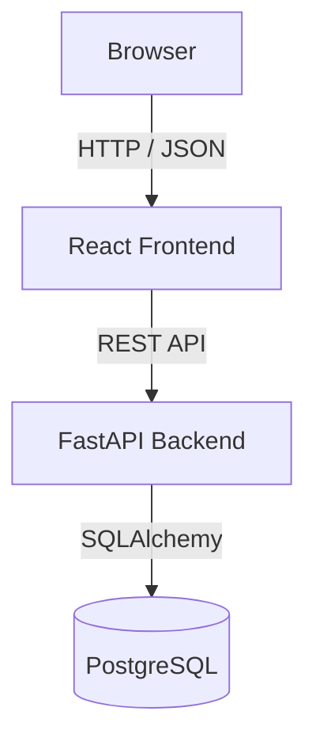
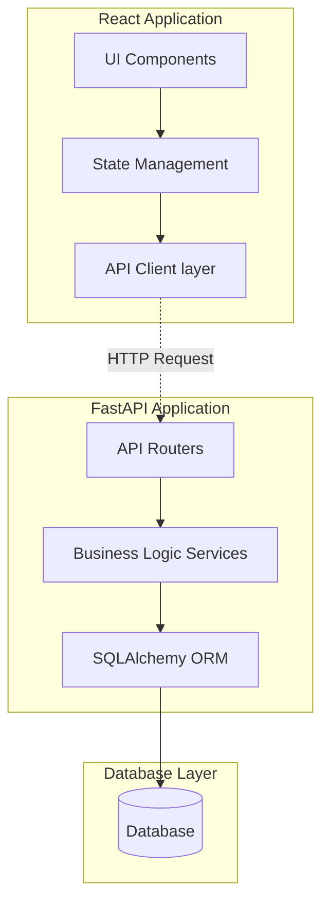

# CloudTask Pro Architecture

## High Level Architecture

The application is built using a modern decoupled architecture where the React frontend communicates with the FastAPI backend over HTTP REST APIs. Data is persisted in a PostgreSQL database (SQLite used for local development/testing).

## Component Diagram

Within the application layers, components are structured as follows:

